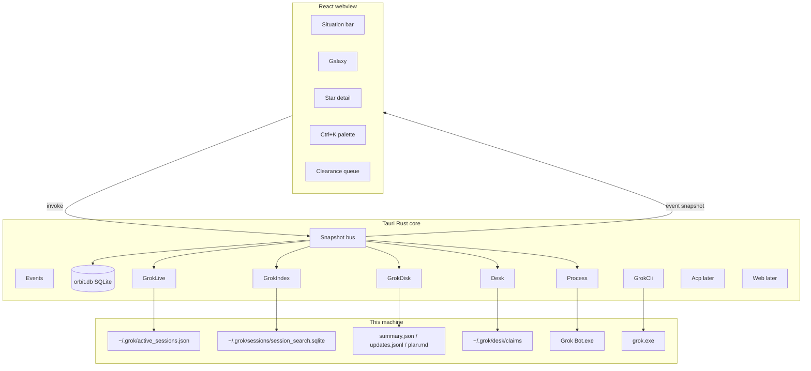

# Grok Orbit - Design Document

| Field | Value |
| --- | --- |
| Status | Phases 1-13 plus COOK and Tide (waiting wells rotate to the front of the next wave) |
| Date | 2026-08-14 |
| Canonical tree | `%USERPROFILE%\grok-orbit` |
| Visibility | Private, proprietary. Private GitHub only. Never public. |
| Collision | `~/orbitstack` is LeoAware / VELA CCA. Different product. Do not mix trees. |
| Author | Grok Build session `01a00022-b643-7b40-9d7e-dc185c67e3c2` from Desktop `TEAM.txt` |

## Overview

Grok Orbit is a local-first Tauri 2 desktop command center. It is the gravitational center for work that today is split across Grok Build CLI/TUI (often more than one pager), Grok web / Build Mode, Grok Bot desktop, and Cursor (web + desktop).

The official Grok Agent Dashboard (`grok dashboard`, `/dashboard`, `Ctrl+\`) is excellent and must stay the in-pager control surface. It only lists top-level agents **in that pager process**. It cannot see the other Grok terminal, Grok Bot, Cursor cloud agents, or grok.com Build Mode. That gap is the 2 a.m. alt-tab problem.

Orbit does not replace the TUI. It sits above the four surfaces, normalizes them into one Project / Session / Attention model, and lets the operator see the fleet in under five seconds, then act (inspect, resume, approve, hand off) without hunting windows.

## Background and motivation

Observed on this machine while writing this document (2026-08-14 morning):

- Two live Grok Build pagers in the user profile (`active_sessions.json`: pids 3700 and 5372).
- Official dashboard in *this* pager cannot show the other pager.
- `knock-desk` exists exactly because `active_sessions.json` lists PIDs, not claimed trees. Orbit must compose with desk, not reinvent it.
- Grok Bot desktop is running (`%LOCALAPPDATA%\Programs\Grok Bot`, multiple processes).
- Cursor desktop is **not** installed (`Cursor.exe` absent). `.cursor` only holds MCP/skills/rules. Cursor web lists Cloud Agents from the daily Brave `cursor.com/agents` tab (CDP page scrape) or the official key API. Never send Brave cookies to `api.cursor.com`.
- Session corpus is large: `~/.grok/sessions/` (tens of thousands of files). The fast index is `~/.grok/sessions/session_search.sqlite` (`session_docs` + FTS5). Do not walk the tree for Galaxy.
- Live session metadata is `summary.json` (title, model, agent_name, timestamps). Transcript is `updates.jsonl` (can be >1 MB). Tail it. Never load whole files into the webview.
- ACP exists: `grok agent stdio` / `serve` / `leader`. No `leader.sock` is up right now. Orchestration that mutates a live TUI session waits for a real ACP attachment, not a reckless `grok -p -r` into a live pager.

Pain this product must kill:

1. Cannot see which agent is waiting.
2. Cannot see the other Grok window.
3. Cannot see Bot vs Build vs Cursor in one place.
4. Cannot approve / continue / hand off without finding the right chrome.

## Goals and non-goals

### Goals

- Instant fleet picture across every **local** source we can read without cloud.
- Drill-down into a session (summary, recent updates, plan if present) without leaving Orbit.
- Keyboard-first (Ctrl+K, j/k, Enter) with a tray badge for attention.
- Graceful degradation: each adapter has `ok | degraded | offline | unauth`.
- Local-first: Galaxy works with the network unplugged for Grok Build disk + live PIDs + Bot process.
- Dogfood: Orbit is itself a Project.

### Non-goals (Phase 1)

- Playwright / grok.com / cursor.com automation.
- Replacing `grok dashboard` inside a pager.
- Auto-approving tools. Orbit never silently yolo.
- Writing tokens, cookies, or `auth.json`.
- Public marketing site, tweet card, visitor counter, i18n.
- Competing with `capability-harness` (skill/MCP graph) or `knock-desk` (tree claims). Compose.

## Key decisions

1. **Keep the name Grok Orbit.** The brief's gravitational metaphor is right. Disambiguate from `orbitstack` in `AGENTS.md` only.
2. **Tauri 2 + React + TypeScript.** Native process control, tray, small binary, Rust watchers. Electron rejected: heavier, weaker default isolation, worse for a security-sensitive local control plane.
3. **Read-local first, ACP second.** Phase 1 is a truthful awareness product on files + PIDs + processes. Phase 2 is bidirectional ACP. Do not fake live control.
4. **Index, do not walk.** Galaxy reads `active_sessions.json` + `session_search.sqlite` + per-live `summary.json`. Full `sessions/` walk is a last-resort repair tool.
5. **Situation bar is deterministic in MVP.** Natural-language paragraph is assembled from facts (counts, titles, desk claims, Bot alive). Optional later: local model or `grok -p` refresh. Never block first paint on an LLM.
6. **Private.** Session transcripts are personal. Proprietary LICENSE. Private GitHub only. Never public. D: bare mirror is the offline backup.
7. **Compose with desk.** Show claims. Warn on unsigned heat. Do not start a second claim protocol.
8. **Identifier** `com.knock.grokorbit`. Data under `%LOCALAPPDATA%\com.knock.grokorbit`. Do not write into `~/.grok/sessions`.
9. **Fontshare Clash Display + Satoshi.** Standing type. Not Inter, not Geist-as-default.
10. **Aesthetic: Night Range Control.** Deep void, ion mint punctuation, ATC language (live / holding / clearance). Calm density, not cyberpunk slop.

## Proposed design

### System architecture



### Unified model

```text
Source        = grok_build | grok_web | grok_bot | cursor
SessionState  = live_working | live_idle | needs_input | holding | disk | unknown | offline
Health        = ok | degraded | offline | unauth

Project { id, name, paths[], remotes[], tags[], updated_at }
Session { id, source, project_id?, cwd, title, summary, state, health, pid?, model?, agent_name?, timestamps, disk_path?, live }
Attention { id, session_id?, source, kind, title, created_at, severity }
Snapshot { generated_at, situation, adapters, projects, sessions, attention, surfaces }
```

Project linking (Phase 7): git remote, then catalog path, then title slugs, then leftover wells (`grok.com`, `cursor.com`, `loose`). Phase 1 cwd buckets are gone.

### Adapter contracts

| Adapter | Phase | Inputs | Outputs |
| --- | --- | --- | --- |
| GrokLive | 1 | `active_sessions.json`, process liveness | live sessions |
| GrokIndex | 1 | `session_search.sqlite` read-only | recent titles, FTS |
| GrokDisk | 1 | `summary.json`, tail `updates.jsonl`, plan files | detail view |
| Desk | 1 | claims JSON | claims as Attention |
| Process | 1 | process table | Grok Bot / Cursor / grok counts |
| GrokCli | 1 | `grok.exe` spawn | resume in new console |
| AcpClient | 2 | `grok agent stdio` | prompt, approve, new session |
| Web adapters | 3 | isolated Playwright + consent file + cache; daily Brave CDP for grok.com + cursor.com/agents | grok.com / cursor.com. Snapshot never launches a browser. |

If sqlite is locked, Galaxy still shows live PIDs.

### Sequence: approve a plan (Phase 2 only)

Phase 1 **detects** `plan.md` / plan mode and offers Resume. It does not press `a` inside another pager. Without a shared leader or an ACP connection owned by Orbit, that would be a lie.

### Snapshot generation (budget ~150 ms)

1. Read `active_sessions.json`.
2. Probe each PID.
3. Read those `summary.json` files only.
4. Query `session_docs` `ORDER BY updated_at DESC LIMIT 80` with `mode=ro`.
5. Merge by `session_id` (live wins).
6. Parse desk claims.
7. Process scan.
8. Build situation string.
9. Emit `snapshot`. Cache last good.

Watch `active_sessions.json` and `desk/claims`. Do not watch all of `sessions/`.

### Frontend shell

Inverted-L + optional third pane. Situation bar always on. Ctrl+K palette. Compact density. Distinct empty / loading / error. Toasts only for spawned actions.

Hotkeys: Ctrl+K, j/k, Enter, Esc, r, o, ?

### Situation bar

Deterministic sentence from facts. Example for this machine:

> 2 Grok Build pagers live on the user profile. Grok Bot desktop is running. Cursor desktop is not installed. Desk has N claims. 0 clearance items.

## API (Tauri commands)

```text
get_snapshot() -> Snapshot
search_sessions(q) -> Session[]
get_session_detail(id) -> SessionDetail
open_cwd(id)
open_session_dir(id)
resume_in_grok(id)
search_sessions(q) -> SearchHit[]  // FTS + snippet
focus_session(id, apply?) -> FocusHit
open_star_window(id)  // second monitor when present
web_status / web_grant_consent / web_revoke_consent / web_open_login / web_refresh
open_session_url(id)  // grok.com or cursor.com only
get_handoff(id) -> HandoffPack
handoff_to_acp(id) -> new session id  // refuses live TUI
```

## Security

- No cloud backend. No telemetry.
- Redact `ghp_`, `github_pat_`, `xai-`, `sk-`, `AKIA` before webview.
- Never open `auth.json`, `mcp_credentials.json`, grokbot token files.
- Session ids must be UUID-shaped. Resolve only under `GROK_HOME/sessions`.
- Phase 1 does not inject prompts into live pagers.
- Web adapters use `%LOCALAPPDATA%\com.knock.grokorbit\web\profiles\*` only. Never copy Chrome/Edge user data. Consent is explicit. Snapshot reads cache files only.

## Alternatives considered

1. Electron - heavier, weaker isolation. Rejected.
2. Only extend official dashboard - cannot see other pagers/Bot. Complementary.
3. Localhost web app - no tray/hotkey/keychain as a product.
4. `grok -p -r` as control plane - two writers on a live TUI. Forbidden.
5. Walk `~/.grok/sessions` every tick - will hitch. Index only.

## Risks

| Risk | Sev | Mitigation |
| --- | --- | --- |
| Schema drift | High | Adapter degraded + fixtures |
| sqlite lock | Med | read-only + live fallback |
| Two writers | High | no inject in Phase 1 |
| 30k sessions | High | limit 80 + virtualize |
| Scope explosion | High | hard phase cut |

## Phased roadmap

| Phase | Ships |
| --- | --- |
| 0 | This document + AGENTS.md |
| 1 | Tauri snapshot + Galaxy + detail + palette + resume/open |
| 2 | ACP client |
| 3 | Bot status, Cursor desktop process, consented grok.com / Cursor web (isolated Playwright, cache-only snapshot) |
| 4 | Orbit MCP stdio (`orbit_mcp.py`, `[mcp_servers.grok-orbit]`) so Grok can query the fleet |
| 5 | Find + focus + feed: FTS snippets in Ctrl+K, Bring to front, activity feed, Star pop-out on second monitor |
| 6 | Cross-tool handoff packs (copy always; new Orbit ACP only when not a live TUI) |
| 7 | Gravity: named project wells, collapse finished Cursor agents, situation names running project. Official Cursor API + tray badge later. |
| 8 | Pulse: cheap ticks, parallel Cursor enrich, one-in-flight refresh + done toast, tray badge + unseen toasts, 60s Cursor pulse (opt-out), Star follow-up confirm. |
| 9 | Flare: Cursor PR URLs become Clearance + Galaxy hot cards + Star Open PR. Slice 2: one card / one clearance row per unique pull. Host-gated github/gitlab only. |
| 10 | Clock: card age from last_active / updated_at. Live quiet >30m shows stale on the card, Situation, Clearance, and tray. |
| 11 | Lens: stage profile + activity-tail memo; Cursor list fingerprint skip; `gh pr view` cache (5 min); Clearance only open PRs; Star shows tail/plan and PR files. |
| 12 | Relay: well members on Star/Galaxy; enriched pack; confirm-once hop (clipboard / ACP / focus+copy / follow-up / desk announce); MCP `orbit_next` / `orbit_well` / `orbit_relay_pack`; Clearance one verb. |
| 13 | Apex: Situation leads with Next; `orbit_next` is cheap (no tasklist/index); Enter runs Clearance verb or opens Star; Star-only `git status --porcelain` (10s memo). |
| COOK | Confirm-once header loop. Cap 4 Grok + 2 Cursor per 5 min tick. Galaxy roster: cooking / sent (window closed = done) / waiting (usually the 4-Grok cap). No Task Scheduler. |
| Tide | COOK wave fairness. Last-sent Grok wells go to the back. Waiting wells (Orbit, AXIOM, SafeDeposit, orbitstack after wave 1) cook next. Galaxy shows Next wave. Desk/live/cook-running still skip. |

## Open questions

1. Attach to live pagers via a future leader, or only `session/load` when idle? Default: idle-only until leader is proven.
2. Global hotkey `Ctrl+Shift+O` unless the operator names another chord.
3. D: survival mirror after the first useful week, not day 1.

## Self-critique

- Under 5 seconds: pass if we do not walk the corpus.
- Approve in 2 keys: fail until Phase 2. UI must not pretend.
- Day-one win: seeing the other Grok pager + Bot process.
- Do not market Phase 1 as a control plane.

## PR Plan

1. Scaffold + law (AGENTS, LICENSE, DESIGN)
2. Snapshot core
3. Mission Control UI
4. Actions (resume/open)
5. ACP later
6. Other surfaces later

## References

- Desktop `TEAM.txt` (local brief, not in this tree)
- `~/.grok/docs/user-guide/15-agent-mode.md`, `17-sessions.md`, `23-dashboard.md`
- `~/.grok/DESK.md`
- Skills: `premium-saas-dashboard-ux`, `fontshare-priority`, `first-pass-ship`, `grok-bot-desktop`, `knock-desk`, `frontend-design`
